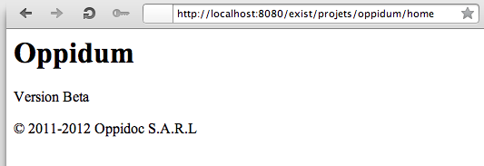
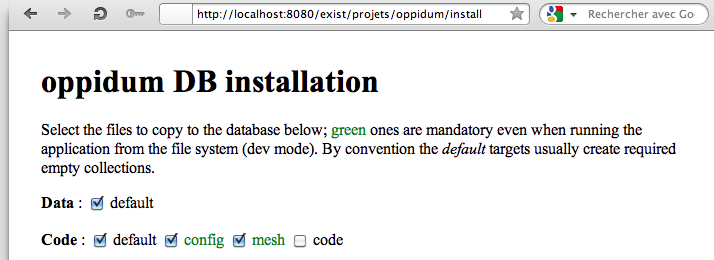
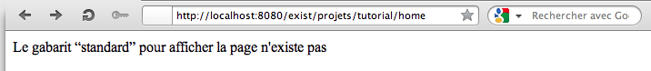
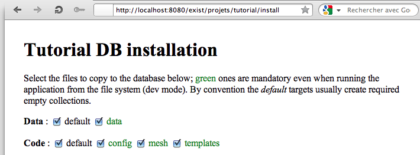
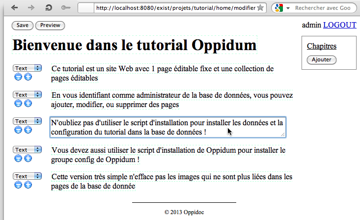
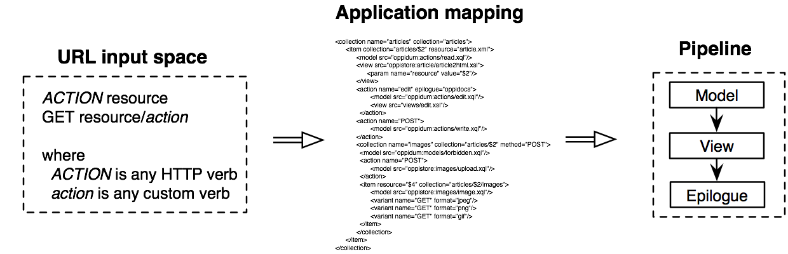
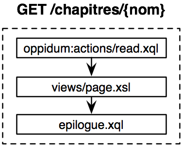
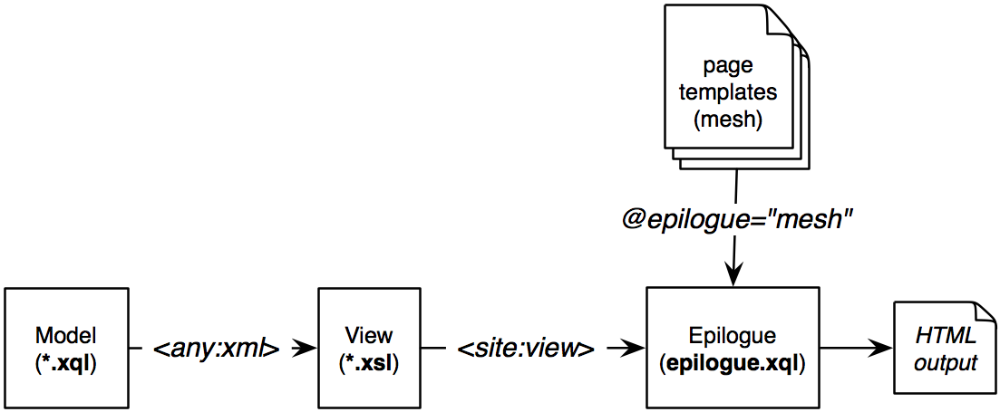
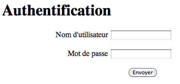

Créer des applications web avec Oppidum
=======================================

Par Stéphane Sire (Oppidoc), <s.sire@oppidoc.fr>, version du 09-04-2013

Ce document présente le framework open source Oppidum pour le développement d'applications web ou pour l'enseignement des technologies XML (XQuery, XSLT, BD XML natives).

Vous pouvez consulter les projets suivants pour accompagner ce document :

- le framework Oppidum contient sa propre application ([lien](https://github.com/ssire/oppidum) github)
- le tutorial est une application très simple d'édition de pages ([lien](https://github.com/ssire/tutorial) github)

**Avertissement** l'environnement d'exécution de Oppidum (côté serveur) est la base de donnée eXist-DB qui fonctionne sur de multiples systèmes d'exploitation (Linux, OS X, Windows), nous avons des retours d'utilisation de Oppidum sous OS X et sous plusieurs variantes de Linux, il semble que Oppidum ne fonctionne pas sous Windows pour des raisons liées à la génération des chemins de fichiers (le séparateur de chemin n'est pas le même sous Windows), c'est une “[issue](https://github.com/ssire/oppidum/issues/10)” enregistrée. Il n'y a pas de limitations connues côté clients (navigateur web).

1. Introduction
-------------

Oppidum est un framework léger conçu pour faciliter le développement d'applications web d'édition et de publication de documents. Oppidum repose sur 3 piliers: un moteur d'éxécution en 2 temps, une architecture 2/3 et des conventions.

### 1.1 Moteur d'exécution en 2 temps

Le schéma suivant représente une vue synoptique du fonctionnement d'Oppidum : dans un premier temps la requête de l'utilisateur sert à générer un *pipeline*; dans un deuxième temps l'environnement hôte exécute le pipeline dont la sortie forme la réponse HTTP.

Oppidum doit donc s'exécuter dans un environnement hôte possédant un moteur d'éxécution de pipeline. Actuellement la librairie de base Oppidum est écrite en XQuery et nécessite une base de donnée XML munie d'un interpéteur XQuery. Nous utilisons la base de données [eXist-db](http://exist-db.org/) qui possède un moteur d'exécution de pipeline basé sur un mini-langage de pipeline.

### 1.2 Architecture 2/3

À la différence des applications 3-tiers classiques où l'application s'exécute dans son propre environnement (Perl, PHP, Ruby, Java, etc.) séparé de la base de données qui sert au stockage des données, les applications écrites avec Oppidum et la base de données eXist-DB s'exécutent dans le même environnement.

Cette architecture parfois qualifée de 2/3 ne sépare donc pas la récupération des données et les traitements / génération des vues. Le code d'extraction des données dans la BD et le code de l'application s'exécutent dans le même programme. Cette architecture offre des avantages en terme de vitesse d'accès aux données puisqu'il n'y a pas de transfert entre un second et un troisième tiers pour lire les données ([lien](http://xquerywebappdev.wordpress.com/2011/11/18/node-js-is-good-for-solving-problems-i-dont-have/#comment-26056)).

Le moteur d'exécution d'Oppidum permet cependant de maintenir une séparation claire dans le code entre les requêtes dans la base de données et le code de génération des vues, puisqu'il permet de générer des pipelines où l'extraction s'effectue à l'aide d'un modèle écrit en XQuery et la génération à l'aide d'une vue écrite en XSLT, même si les deux seront exécutés par le même tiers.

### 1.3 Conventions

Oppidum repose sur des conventions pour organiser et structurer une application. Les conventions cristallisent des bonnes pratiques et facilitent la maintenance des projets.

Le point d'entrée d'une application est le fichier `controller.xql` qui se trouve à la racine de l'application et qui appelle Oppidum en lui transmettant la requête HTTP à décoder. Le fichier `epiloque.xql` qui se trouve aussi à la racine de l'application termine le traitement de toutes les requêtes et effectue les opérations répétitives telles que l'insertion d'un en-tête ou d'un menu de navigation sur les pages de l'application.

En production les données et le code de l'application _app_ sont placées dans la BD, dans une collection `/db/sites/`_app_ pour les données et dans une collection `/db/www/`_app_ pour le code. En particuliers la collection `/db/www/`_app_`/config` contient les ressources XML avec la configuration de l'application.

### 1.4 Sources d'inspiration

Oppidum s'inspire des frameworks _Orbeon_ et _Ruby on Rails_. Comme avec Orbeon le rendu des pages s'effectue par la transformation de données en une représentation à l'aide d'un pipeline (approche MVC). Le pipeline de rendu obéit toujours au même schéma à trois étages : le modèle est un script XQuery qui extrait des données; la vue est un script XSLT qui les transforme; le résultat peut-être inséré à la demande dans un *gabarit de site* (ou *mesh*) écrit avec un langage spécifique. Cette dernière opération est réalisée par un script appelé *epilogue*.

Comme avec RoR, l'architecture REST du site est explicite et la correspondance entre les URLs des ressources qui forment le site et leur implémentation, sous forme de pipeline, est décrite dans un langage spécifique : le *mapping* du site (plus ou moins équivalent aux routes de RoR). De manière plus annedoctique Oppidum fournit également une *flash* pour afficher des messages d'erreur ou d'information à l'utilisateur même après une redirection de page.

Oppidum contient également des modèles et vues de base pour réaliser des fonctionnalités comme un login et du contrôle d'accès, ou bien l'édition et la publication de pages avec les librairies Javascript [AXEL](http://ssire.github.com/axel/) et [AXEL-FORMS](http://ssire.github.com/axel-forms/) fournies avec. Ces librairies offrent un niveau de fonctionnalités similaires à XForms pour la plupart des projets avec une moindre complexité. Elles sont maintenues dans des projets séparés sur GitHub.

Enfin il est facile d'isoler des fonctionnalités dans des unités de code (XQuery/XSLT/Javascript) pouvant être recopiés d'application à application avec peu d'adaptations. Il existe par exemple un module de téléchargement d'images (lié avec la librairie AXEL).

Oppidum et ses modules sont définis dans le namespace `"http://oppidoc.com/oppidum/"` et ses dérivés.

2. Mise en oeuvre
----

### 2.1 Installation

Commencez par installer eXist-db ([téléchargement](http://exist-db.org/exist/download.xml)). Installez pour le moment une version 1.4.3, la version 2.0 de eXist nécessite quelques modifications dans la façon de structurer les applications pour en tirer meilleur parti.

Lorsque eXist est installé, placez-vous, à l'aide du terminal, dans le répertoire `{exist-home}/webapp`, créez un répertoire (par exemple `projets`) puis clonez le dépôt Github de Oppidum à l'intérieur. Oppidum fournit une commande `scripts/start.sh` pour démarrer eXist, exécutez-la (ou bien démarrez eXist avec la procédure standard), soit :

    cd {exist-home}/webapp
    mkdir projets
    git clone https://github.com/ssire/oppidum.git
    cd oppidum/scripts
    ./start.sh

Vous devriez alors pouvoir pointer votre navigateur sur l'URL <a href="http:/localhost:8080/exist/projets/oppidum" target="_blank">localhost:8080/exist/projets/oppidum</a> et voir le message suivant signifiant que Oppidum a été bien installé :

Une fois cette vérification faite, pointez votre navigateur sur <a target="_blank" href="http://localhost:8080/exist/projets/oppidum/install">localhost:8080/exist/projets/oppidum/install</a> et cochez au moins le groupe config de la ligne "Code :" pour installer les fichiers de configuration de Oppidum, puis cliquez sur le bouton de soumission (non visible sur la copie écran ci-dessous). Vous devrez vous identifier comme l'utilisateur _admin_ de la BD défini lors de l'installation d'eXist. 

**Attention** dans la version actuelle d'Oppidum le script d'installation ne s'exécutera correctement que si le répertoire contenant Oppidum s'appelle `projets`. Si vous utilisez un autre nom vous devrez éditer la ligne suivante du script `scripts/install.xql` :

    declare variable $local:base := "/projets/oppidum";

Vous pouvez utiliser le script `scripts/stop.sh` dans le terminal pour arrêter eXist, à condition de l'éditer et de mettre le bon mot de passe administrateur de la BD dedans (par défaut mis à _test_).

### Installation du tutorial

Placez vous dans votre répertoire `projets` créé à l'étape précédente : 

    git clone https://github.com/ssire/tutorial.git

Vous pouvez alors ouvrir le tutorial en pointant votre navigateur sur <a target="_blank" href="http://localhost:8080/exist/projets/tutorial">localhost:8080/exist/projets/tutorial</a>. Notez que vous devriez obtenir un écran d'erreur la première fois, comme ci-dessous :

Cette erreur provient du fait que le tutorial, tout comme les applications écrites avec Oppidum, nécessite la création et la recopie de plusieurs ressources dans la BD. Installez ces ressources avec l'installeur compris dans le tutorial en pointant votre navigateur sur <a target="_blank" href="http://localhost:8080/exist/projets/tutorial/install">localhost:8080/exist/projets/tutorial/install</a> (voir la remarque ci-dessus “_Attention_”). Dans le cas du tutorial il convient de tout cocher :
 

Voilà, vous pouvez utiliser le tutorial. Le tutorial est une application très simple qui possède une page d'accueil, des chapitres et un bouton pour s'identifier. Si vous ête identifié comme utilisateur _admin_ de la BD, vous pouvez modifier la page d'accueil et ajouter des chapitres, comme sur la copie écran ci-dessous :

Ce document explique tous les concepts mis en oeuvre pour créer le tutorial et d'autres applications.

### 2.2 Création d'un nouveau projet

Placez vos projets dans des répertoires {_app_} dans des répertoires frères du répertoire `oppidum`, vous devriez obtenir la structure suivante:

    {exist-home}/webapps/projets/oppidum
    {exist-home}/webapps/projets/{app}

Vous pourrez ainsi accéder sur le même serveur à l'environnement de développement eXist (aide en ligne, sandbox, etc. via <a target="_blank" href="http://localhost:8080/exist">localhost:8080/exist</a>) ainsi qu'à vos applications en cours de développement (via `http://localhost:8080/exist/projet/{app}`).

L'intérêt est aussi de maintenir le répertoire `/projet/{app}` sous contrôle du code source avec un système comme SVN ou GitHub.

Le fichier `controller.xql` contient des définitions de variables comme le mapping, qui seront transmise à la méthode `gen:process` de Oppidum pour traiter la requête entrante. Vous pouvez copier ce fichier à la racine de l'application depuis celui fourni avec Oppidum ou tout autre projet réalisé avec Oppidum, en adaptant les déclarations de variables.

Dans la plupart des projets, le fichier `epilogue.xql` à la racine de l'application met en oeuvre un mécanisme de génération de page à partir d'un modèle de page expliqué dans la section “Gabarits de pages (ou mesh)”. Il s'articule autour d'une _transformation typeswitch_  ([lien](http://en.wikibooks.org/wiki/XQuery/Typeswitch_Transformations) wikibooks) réalisée par une paire de méthodes `local:render` et `local:branch` que vous pouvez copier d'un projet à un autre.

### 2.3 Debug

Ajoutez `.debug` ou `?debug=true` à une URL pour voir tous les attributs ajoutés par Oppidum à la requête et qui sont accessibles avec `request:get-attribute` dans les modèles XQuery. L'affichage en mode debug montre également la commande ainsi que les pipelines générés en interne (voir la section “Architecture d’Oppidum”), c'est un bon moyen pour comprendre le fonctionnement d'Oppidum.

Ajoutez `.raw` à une requête pour voir la sortie de l'étape 2 du pipeline (transformation XSLT).

Ajoutez `.xml` à une requête pour voir la sortie de l'étape 1 du pipeline (modèle XQuery), c'est aussi le moyen le plus simple pour exporter le source XML d'une ressource, par exemple pour l'éditer avec un template XTiger XML (voir la section “Créations de page éditables avec AXEL”).

Utilisez les méthodes `oppidum:log` et `oppidum:log-parameters` du module `util.xqm` pour créer des traces d'exécution dans un fichier `site.log` conservé avec les autres fichiers de log (`exist.log` et `url-rewrite.log`).

3. Modèle d'une application Oppidum
------------------------

Le développement d'une application obéit aux principes suivants : 

- l'application doit être entièrement définie en terme d'actions sur des ressources
- chaque action est définie déclarativement dans un fichier de mapping comme un pipeline composé de 3 étapes 
  - la première étape, le **modèle**, est toujours un script XQuery;
  - la seconde édtape, la **vue**, est toujours une transformation XSLT;
  - la troisième étape, l'**épilogue**, est toujours un script XQuery qui s'appelle `epilogue.xql`
- un pipeline se compose soit de la première étape uniquement, la première et la seconde, la première et la troisième, ou bien les trois.

Il est toujours possible d'étendre un pipeline en appelant une ou plusieurs transformations XSLT depuis la première ou la troisième étape.

Toute ressource est associée implicitement avec une action de lecture (GET) qui retourne une représentation de la ressource. Nous verrons par la suite qu'il est possible de spécifier des actions à l'aide des verbes HTTP (GET, PUT, POST, DELETE, etc.) mais aussi de créer des actions personnalisées. Dans ce cas le verbe est ajouté comme dernier segment de l'URL qui désigne la ressource cible (e.g. `/articles/1/`_publier_).

### 3.1 Définition des ressources

Le mapping décrit l'_architecture REST_ du site, c'est-à-dire qu'il définit l'ensemble des ressources et des actions qui seront reconnues par l'application sous forme d'URLs et de verbes HTTP. Il définit également le pipeline associé avec chacune de ces cibles. 

Le mapping décrit l'arborescence du site par un arbre XML composé de deux types d'éléments: *item* et *collection*. Il se déclare sous l'élément racine *site*. Prenons l'exemple fictif suivant :

    <site>
      <item name="home"/>
      <item name="projets">
        <item name="axel"/>
        <item name="oppidum"/>
      </item>
    </site>

Il décrit un site composé des ressources `/home`, `/projets`, `/projets/axel`, `/projets/oppidum`. 

L'attribute **name** indique un segment d'URL qui mène à la ressource concernée.

Par convention les ressources identifiées par l'élément __item__ représentent des ressources simples ne contenant aucune autre ressource ou bien un nombre connu d'avance de ressources nommées ou d'actions. Nous appellerons ces ressources des items pour les distinguer.

Par convention les ressources identifiées par l'élément __collection__ représentent des ressources contenant un nombre indéfini de ressources non nommées à l'avance. Nous appellerons ces ressources des collections pour les distinguer. Dans ce cas l'ensemble des ressources contenues dans une collection est représenté par un élément __item__ anonyme, c'est à dire sans attribute __name_. 

Prenons l'exemple d'une application pour écrire et publier des articles :

    <site>
      <collection name="articles">
        <item/>
      </collection>
    </site>

Elle pourrait contenir les ressources suivantes : `/articles/`, `/articles/1`, `/articles/2`. De même elle pourrait contenir les ressources suivantes : `/articles/foo`, `/articles/bar`, puisqu'aucune contrainte ne pèse sur le nom de l'item anonyme.

Il est également possible d'inclure des items nommés ou bien des sous-collections au sein d'une collection. Dans ce cas leurs noms sont réservés et ne sont plus disponibles pour l'item anonyme.

Par exemple la collection _articles_ de l'application pourrait contenir une collection _auteurs_ qui donnerait accès aux fiches descriptives des auteurs. Dans ce cas elle serait déclarée ainsi :

    <site>
      <collection name="articles">
        <item/>
        <collection name="auteurs">
          <item/>
        </collection>
      </collection>
    </site>

La définition ci-dessus autorise l'existence de ressources telles que `/articles/auteurs/foo` ou `/articles/auteurs/bar`.

Ces exemples montrent la souplesse de l'imbrication de seulement deux types d'éléments collection et item (anonyme ou non) pour modéliser une hiérarchie des ressources. **Tous les sites réalisés avec Oppidum doivent au préalable être modélisés suivant cette hiérarchie**.

### 3.2 Définition des actions de lecture (GET) dans le mapping

La structuration du mapping donne les moyens de spécifier toutes les URLs valides pour une application. Le mapping est ensuite complété avec des éléments **model**, **view** sous chaque item ou collection, et l'attribut **epilogue**, pour définir le pipeline de l'action de lecture (GET) de chaque ressource cible.

Prenons l'extrait de mapping suivant issu du tutorial :

    <collection name="chapitres" ... >
      <item epilogue="standard" ... >
        <model src="oppidum:actions/read.xql"/>
        <view src="views/page.xsl"/>
        ...
      </item>
      ...
    </collection>

Cet extrait déclare que pour une requête GET sur une ressource de la forme `/chapitres/{nom}` (ciblée par l'item anonyme), la représentation retournée est générée par l'exécution du script XQuery `actions/read.xql` de la librairie Oppidum (préfixe `oppidum:`), puis transformation du résultat par la feuille XSLT `views/page.xsl` de l'application, et enfin par insertion dans le gabarit de page `standard.html` par l'épilogue du site.

Notons que l'extrait de mapping précédent ne définit par d'action pour lire la collection `/chapitres/`. Par conséquent l'ouverture de cette URL déclencherait une erreur “pipeline non défini”. 

Les chemins d'accès aux scripts XQuery ou XSLT sont exprimés relativement au fichier `controller.xql` à la racine de l'application. Il est toutefois possible d'utiliser le préfixe `oppidum:` devant le chemin pour désigner un script fourni en standard avec Oppidum. Par exemple le chemin `oppidum:models/lore-ipsum.xql` désigne le générateur de contenu *lore ipsum* fourni avec Oppidum.

### 3.3 Définition de toutes les actions sur les ressources et paramétrage des modèles et des vues

Les autres actions sur les items ou les collections se déclarent explicitement à l'aide de l'attribut **method** pour les verbes HTTP et de l'attribut **supported** pour les actions personnalisées. Dans les deux cas le pipeline associé avec l'action doit être défini par un élément fils **action** contenant les éléments _model_, _view_ et l'attribut _epilogue_ tout comme pour la déclaration de l'action de lecture.

Par exemple l'extrait de mapping suivant issu du tutorial ajoute les actions _ajouter_ et _POST_ à la collection _chapitres_ pour respectivement créer un nouveau chapitre et l'enregistrer :

    <collection name="chapitres" collection="chapters" supported="ajouter" method="POST" template="templates/page">
      <item epilogue="standard" ... >
        <model src="oppidum:actions/read.xql"/>
        <view src="views/page.xsl"/>
        ...
      </item>
      <action name="ajouter" epilogue="standard">
        <model src="oppidum:actions/bootstrap.xql"/>
        <view src="views/edit.xsl">
          <param name="skin" value="editor"/>
        </view>
      </action>
      <action name="POST">
        <model src="modules/chapters/post.xql"/>
      </action>
    </collection>
    
Cet extrait de mapping donne existence aux URLs suivantes :

- `GET /chapitres/{nom}` retourne une version HTML d'un chapitre (déjà évoqué au 3.2)
- `GET /chapitres/ajouter` retourne une page HTML intégrant un éditeur réalisé avec AXEL pour créer un chapitre, ce qui nécessite la définition d'une resources supplémentaire  :
  - `GET /templates/page` retourne le template XTiger XML servant à générer l'éditeur de chapitre
- `POST /articles/` sauvegarde le nouvel article dans la BD
  
Cet extrait montre comment utiliser plusieurs types d'actions pour réaliser une application d'édition et de publication : l'action `ajouter` (cf. la section “Créations de page éditables avec AXEL” ci-dessous) génère l'éditeur, l'action `POST` assurent la sauvegarde des données.

Les attributs _collection_ et _resource_ figurant dans l'extrait ci-dessus sont expliqués dans la section “Découplage du schéma physique de stockage des données”.

#### Paramétrage

L'extrait montre également comment transmettre des paramètres à la vue d'un pipeline à l'aide d'un élément **param** définit à l'intérieur d'un élément _view_. L'attribut **name** définit le nom du paramètre et l'attribute **value** sa valeur. Par exemple le paramètre _skin_ de l'action _ajouter_ contient la chaine `"editor"`.

Les paramètres sont transmis aux vues XSLT comme paramètres de l'environnement dont les noms sont préfixés par la chaine `"xslt."`. La ligne suivante, à placer au début de la transformation XSLT, récupère la valeur du paramètre _skin_ définie dans le mapping dans le paramètre _xst.skin_ de la transformation XSLT :

    <xsl:param name="xslt.skin"></xsl:param>
    
L'élément _param_ peut aussi se placer dans un élément _model_, dans ce cas il sera récupéré dans le script XQuery sous la forme d'un attribut de la requête préfixé par la chaine `"xquery."`, par exemple  si le paramètre _skin_ avait été déclaré dans l'élément _model_, la ligne suivante le récupérerait dans la variable `$skin` :

    let $skin := request:get-attribute('xquery.skin')
    
Le paramétrage des modèles et des vues au niveau du mapping est un moyen pratique pour écrire des scripts XQuery et les transformations XSLT réutilisables dans différents contextes.

### Variables positionnelles 

Les valeurs des paramètres peuvent aussi réintégrer des segments de l'URL à l'aide de variables positionnelles de la forme `$k`. La variable sera substituée par le _k_-ième segment de l'URL lors de l'invocation du modèle ou de la vue. 

Par exemple le paramètre suivant :

    <param name="resource" value="$2"/>
    
serait substitué par le 2e segment de l'URL.

#### 3.4 Déclaration du mapping

Le mapping doit être passé comme dernier paramètre de la méthode `gen:process` qui traite la requête HTTP entrante dans le contrôleur de l'application (voir le fichier [controller.xql](https://github.com/ssire/oppidum/blob/master/controller.xql) de Oppidum).

Vous pouvez déclarer le mapping directement dans une variable du fichier `controller.xql` : 

    declare variable $mapping := <site>...</site>
    
Alternativement, et c'est ce que nous recommandons en production, vous pouvez stocker le mapping dans la ressource `/db/www/{app}/config/mapping.xml` de la BD et le charger dans une variable passée à la méthode `gen:process` :

    declare variable $mapping := fn:doc(`/db/www/{app}/config/mapping.xml`)

Notez que le mapping est déclaré sous une racine **site** qui représente la racine du site (la ressource REST `/`). Celui-ci doit définir les attributs suivants :

- **db** : chemin de la collection racine pour toutes les données de l'application (par convention `db/sites/{app}`)
- **confbase** : chemin de la collection racine pour le code source de l'application (par convention `db/www/{app}`)
- **startref** : URL vers où rediriger les requêtes sur la racine `/`, c'est-à-dire le point d'entrée de l'application
- **key** : nom du répertoire sur disque et des collections racines dans la BD du projet (le répertoire {_app_})
- **mode** : mode d'exécution (`dev` pour développement, `test` pour test et `prod` pour production), celui-ci sera recopié dans la commande en interne et peut influencer certaines méthodes de l'API d'Oppidum (par ex. la génération des URLs statiques si vous utilisez les skins)

En option il est possible d'associer des actions avec la racine du site à l'aide des attributs **supported** et **method** comme expliqué ci-desssus, puisque la racine est une ressource cible.

#### 3.5 Attributs hérités dans le mapping

Les attributs suivants sont hérités dans le mapping, c'est-à dire que lorsqu'ils sont déclarés sur un élement `site` (la racine), `collection` ou `item` ils sont copiés sur son élément fils, sauf si le fils redéfinit l'attribut correspondant :

- _db_ (point de départ des collections de référence)
- _collection_ (collection de référence)
- _resource_ (ressource de référence)
- _access_ (droits d'accès en lecture, c-a-d pour l'action implicite de lecture GET, cf la section “Contrôle d'accès par formulaire”)

### 3.6 Déclarations d'actions en dehors du mapping

Pour simplifier le partage des définitions d'actions entre applications il est possible de définir les actions à 2 autres endroits :

- dans une variable `$actions` du contrôleur `controller.xql` à passer comme paramètre à la fonction `gen:process`
- dans une resource `/db/www/{app}/config/modules.xml`

La première méthode est utilisée dans le fichier [controller.xql](https://github.com/ssire/oppidum/blob/master/controller.xql) de Oppidum pour définir les 3 actions par défaut _login_, _logout_ et _install_. Les actions déclarées dans la variable `$actions` sont des actions par défaut dont les définitions sont héritées par toutes les cibles du mapping, à condition qu'elles les listent dans leur attribut _supported_ ou _method_.

La déclaration des actions par défaut s'effectue comme la déclaration des actions au fil du mapping. La seule différence est la présence d'un attribut **depth** sur l'élément _action_. Cet attribut indique le rang dans les segments de l'URL auxquels l'action peut s'appliquer. Cette information est nécessaire pour faire fonctionner l'algorithme _d'héritage_.

Ainsi :

- les actions de rang 0 peuvent se trouver uniquement à la racine du site, comme `/login` ou `/logout`.
- les actions de rang 1 peuvent se trouver uniquement comme action d'une resource située directement sous la racine du site comme `/home/editer` ou `POST /home`.
- etc.

La seconde méthode repose sur un élément **import** à placer comme fils d'une déclaration d'item ou de collection dans le mapping. Cet élément importe la définition d'un ensemble d'actions depuis la ressource `/db/www/{app}/config/modules.xml` de l'application.

Cette méthode encore en cours de développement et de test sera expliqué prochainement.

### 3.7 Organisation du code

Cette section n'est pas normative, vous pouvez organiser le code comme vous le voulez (sauf pour les fichiers `controller.xql` et `epilogue.xql` à la racine). Cependant nous avons trouvé pratique de structurer les fichiers des applications de la manière suivante :

    actions/
    controller.xql
    epilogue.xql
    init/
    mesh/
    models/
    modules/
    ressources/
    scripts/
    templates/
    views/

Le fichier *controller.xql* est imposé par eXist. C'est le point d'entrée qui recevra les requêtes HTTP et appelera la fonction `gen:process` pour générer le pipeline à exécuter.

Le fichier *epilogue.xql* est exécuté par le pipeline si et seulement si la cible du mapping possède un attribut _epilogue_, il peut servir par exemple à générer la page à partir d'un gabarit comme expliqué dans la section “Gabarits de pages (ou mesh)”.

Les répertoires *models* et  *actions* contiennent les scripts XQuery qui implémentent respectivement les modèles pour la lecture des ressources et les actions sur les ressources.

Le répertoirs *views* contient les scripts XSLT qui implémentent les vues.

Le répertoire *modules* contient également des scripts de vues et de modèles, mais en les regroupant par modules fonctionnels de manière à simplifier le partage entre applications (pour le moment par recopie du répertoire contenant le module intéressant).

Le répertoire *init* contient les fichiers de configuration de l'application qui seront copiés dans la collection `/db/www/{app}/config` de l'application ainsi que les éventuels fichiers utilisés pour générer les données initiales dans `/db/sites/{app}/` ou pour tester l'application. Le contenu de ce répertoire peut être en partie généré avec le script d'installation comme expliqué dans la section “Installation et déploiement”.

Le répertoire *scripts* contient le script d'installation `install.xql` pour installer l'applications dans la BD et créer un jeu d'utilisateurs minimal. Il peut éventuellement contenir d'autres scripts utilisés pendant le développement (par exemple des scripts ant pour le test, le packaging ou le déploiement).

Le répertoire *resources* contient toutes les ressources statiques du site regroupées en sous-répertoires (e.g. CSS, Javascript, images). Oppidum fournit quelques méthodes pour générer des URLs pointant vers ces ressources dont le chemin commence par `/static/{app}` (ou `/static/oppidum` pour les ressources statiques partagées par Oppidum telles que la librairie AXEL). En production ces URLs devraient être servies directement par le proxy web sans passer par la BD pour bénéficier d'une politique de cache efficace.

Le répertoire *mesh* contient le ou les gabarits utilisés dans l'application. Chaque gabarit est un fichier XHTML. En se débrouillant bien chaque fichier gabarit devrait pouvoir s'afficher directement dans le navigateur web pour tester les fichiers CSS correspondants sans démarrer le serveur.

Enfin le répertoire *templates* regroupe les templates XTiger XML utilisés par le site pour rendre les pages éditables.

Notez que la librairie Oppidum elle-même contient un répertoire *config* . Celui-ci regroupe des fichiers de configuration spécifiques à eXist-DB et à l'environnement servlet (`conf.xml`, `controller-config`, `log4j.xml` et `web.xml`) qui sont utilisés pour générer les fichiers WAR lors du packaging à destination de différents environnements d'exécution (e.g. Tomcat) pour le passage en production.

4. Patrons de conception
------------------------

L'utilisation de patrons de conception définis dans cette section simplifie développement d'applications web avec Oppidum. Certains partons sont supportés directement au niveau de l'API d'Oppidum et des conventions mise en oeuvre.

### 4.1 Gabarits de pages (ou mesh)

Le générateur de pipeline n'inclue l'appel à l'épilogue que si la cible du mapping possède un attribute _epilogue_. Nous recommandons d'interpréter la valeur de cet attribut comme le nom d'un gabarit de page à recopier pour générer la réponse à la requête HTTP. Ce mécanisme est très pratique pour factoriser dans le gabarit les éléments communs des pages tels que les en-têtes, les pieds de page, un bouton “login” ou bien le menu de navigation. Il est résumé sur la figure ci-dessous.

Le mécanisme recommandé repose sur une convention sur le format de sortie de la vue : celle-ci doit produire un document XML dont la racine est un élément **site:view** ne contenant que des fils dans l'espace de nom **site:**. Grâce à cette convention, le script `epilogue.xql` génère la réponse à la requête HTTP en recopiant un fichier XHTML correspondant au gabarit (voir le gabarit  [standard.html](https://github.com/ssire/tutorial/blob/master/mesh/standard.html) du tutorial); à chaque fois qu'il rencontre un élément dans l'espace de nom _site:_ dans le gabarit, il le remplace :

1. par le résultat de l'appel à une méthode XQuery de même nom si elle est définie dans le script `epilogue.xql` et si l'élément du gabarit possède un attribute `force="true"` ou bien si le flux d'entrée de l'épilogue possède un élément de même nom;
2. sinon par l'élément de même nom dans le flux d'entrée de l'épilogue s'il existe;
3. sinon par la sequence vide.

Par exemple si le gabarit contient un élément `<site:menu force="true">` l'épilogue devrait appeler la méthode `site:menu` quel que soit le flux d'entrée et le remplacer par son résultat. Si le gabarit contient un élément `<site:menu>` alors si le flux d'entrée contient un élément `<site:menu>` l'épilogue devrait remplacer l'élément `<site:menu>` du gabarit par le résultat de l'appel à la méthode `site:menu` _de l'épilogue_ si elle existe, ou sinon par l'élément `<site:menu>` _du flux d'entrée_, ou par la sequence vide sinon.

Cette logique est implémentée à l'aide d'une _transformation typeswitch_ reposant sur l'appel entrelacé aux méthodes `local:render` et `local:branch` de l'épilogue. Cette logique est très facile à adapter lorsque vous créez le fichier `epilogue.xql` de votre application en recopiant celui d'une application existante (voir le fichier [epilogue.xql](https://github.com/ssire/oppidum/blob/master/epilogue.xql) de Oppidum).

Par convention le nom du fichier gabarit à employer est le nom du gabarit lui-même (la valeur de l'attribut _epilogue_ de la cible du mapping) terminée par le suffixe “.html”. Les gabarits sont stockés dans la collection `/db/www/{app}/mesh` de la BD, et se trouvent dans le répertoire `mesh` dans l'arborescence de fichiers du projet.

### 4.2 “Skins”

Le mécanisme des gabarits peut servir à découpler l'inclusion des fichiers CSS et Javascript de la génération du contenu de la page. Pour cela il suffit que l'épilogue définisse une fonction `site:skin` à appeler pour remplacer l'élément `<site:skin>` placé dans l'élément `<head>` du gabarit. Cette fonction doit retourner les balises HTML des fichiers CSS et Javascript souhaités. Voici un exemple de fonction correspondante : 

    declare function site:skin( $cmd as element(), $view as element() ) as node()*
    {
      (
      skin:gen-skin('app', oppidum:get-epilogue($cmd), $view/@skin)
      )
    };

La fonction ci-dessus utilise la fonction `skin:gen-skin` du *module skin* de Oppidum pour gérer l'association entre des chaines de caractères (ou token) et des ensembles de fichiers CSS et Javascript baptisés **profils**. Les associations sont déclarées dans une ressource `/db/www/{app}/config/skin.xml` dans la base de données. La fonction `skin:gen-skin` retourne le code HTML d'inclusion des fichiers CSS et Javascript en fonction du nom de l'application, du nom du gabarit (la valeur de l'attribut _epilogue_ retournée par `oppidum:get-epilogue($cmd)`) et de la chaine passée dans l'attribut *skin* de l'élément `<site:view>` du flux d'entrée de l'épilogue (`$view/@skin`). Bien sûr vous pouvez utiliser tout autre méthode.

Il est possible de déclarer plusieurs profils :

- un profil universel `*` s'appliquant à toutes les pages 
- un profil associé avec le nom du gabarit de la page
- un ou des profils associés avec des mots clefs contenus dans l'attribut _skin_ de l'élément `<site:view>` du flux d'entrée

Par ailleurs il est possible d'associer des profils appelés _handlers_ avec différents événements surgissant pendant le traitement du pipeline. Pour le moment seul l'événement **msg-or-error** est défini pour une page donnée si une erreur ou un message ont été “signalés” en utilisant l'API d'Oppidum.

Voici un exemple de ressource `skin.xml` :

    <skin xmlns="http://oppidoc.com/oppidum/skin">
      <handler name="msg-or-err">
        <predef module="oppidum">flash</predef>
      </handler>
      <profile name="*">
        <link rel="shortcut icon" type="image/x-icon" href="images/favicon.ico"/>
        <link href="css/960.css"/>
      </profile>
      <profile name="standard" type="mesh">
        <link href="css/site.css"/>
        <script src="lib/site.js"/>
      </profile>
      <profile name="editor">
        <link href="css/page.css"/>
        <predef module="oppidum" avoid="error()">axel-1.3</predef>
        <predef module="oppidum" avoid="error()">photo</predef>
      </profile>
    </skin>

L'élément **handler** déclare un profil correspondant à un événement.

L'élément **profile** déclare un profil. L'attribut **name** vaut `*` pour le profil universel; il contient le nom du gabarit associé si l'attribute `type="mesh"` est défini; sinon il contient un token à associer avec la liste de mot-clefs séparés par un espace de l'attribut _skin_ du flux d'entrée.

Les éléments **link** et **script** déclarent les ficheirs CSS et Javascript du profil. Leurs attributs **href**, **src**, **rel** et **type** seront recopiés sur une balise HTML _link_ ou _script_ qui sera générée. Les chemins des attributs _href_ et _src_ sont relatifs au répertoire `resources` du répertoire contenant l'application.

L'élément **predef** importe un profil prédéfini venant d'une autre application désignée par la valeur de l'attribut **module**. Ces profils prédéfinis sont eux-mêmes déclarés avec un attribute `type="predef"` comme vous pouvez le voir dans le fichier [skin.xml](https://github.com/ssire/oppidum/blob/master/init/skin.xml) fourni avec Oppidum et qui contient un certain nombre de profils prédéfinis. Pour que l'importation fonctionne il faut bien sûr que la skin correspondante au module soit présente dans la BD à l'emplacement `/db/www/{module}/config/skin.xml` (où _module_ vaut `oppidum` pour importer les profils fournis avec Oppidum).

Les attributs optionnels **avoid** ou **meet** définis sur certains éléments _link_, _script_ ou _predef_ rendent ces éléments conditionnels. Leur valeur est une liste de prédicats séparés par des espaces :

- le prédicat **error()** est vrai si une erreur est survenue dans le pipeline
- le prédicat **mode(_name_)** est vrai si le mode vaut _name_ (c'est-à-dire _dev_, _test_ ou _prod_)
- le predicat **action(_name_)** est vrai si la requête traite d'une action _name_ sur la ressource cible
- le prédicat **trail(_expression_)** est vrai si le chemin de l'URL précédant l'action correspond à l'epxression, où l'expression est une chaine de caractère de type expression régulière

### 4.3 Gestion des erreurs

Le besoin de signaler les erreurs survenant pendant le traitement d'une requête est récurrent. Les erreurs qui empêchent la génération du pipeline sont émises directement par Oppidum, ce sont les erreurs pré-traitement. Les erreurs à l'exécution sont les erreurs émises explicitement par les scripts XQuery en utilisant la fonction `oppidum:throw-error` de l'API Oppidum. Enfin certaines erreurs ne sont pas capturées du tout par Oppidum, c'est le cas par exemple lorsque la transformation XSLT d'une vue est incorrecte, ou si l'étape de génération du modèle ne génère pas de document, dans ce cas c'est une page d'erreur générée par eXist qui est retournée.

Les erreurs pré-traitement ou les erreurs à l'exécution sont conservées dans une variable de la session appelée _flash_. Il est ainsi possible de signaler plusieurs erreurs simultanément et de les faire survivre à une ou plusieurs redirections pour les générer dans la page finale. Ces erreurs sont associées avec un **identifiant d'erreur** unique qui sert de clef pour la génération du message.

Les messages d'erreurs sont conservés dans la collection de configuration de l'application dans la BD, ceci pour simplifier la gestion multilingues et partager certains messages. Un certain nombre de messages d'erreur sont définis en standard dans la configuration d'Oppidum (voir le fichier <a target="_blank" href="https://github.com/ssire/oppidum/blob/master/init/errors.xml">errors.xml</a> de Oppidum).

#### Erreurs pré-traitement

Lorsqu'une erreur pré-traitement survient, Oppidum génère un pipeline particuliers en lieu et place du pipeline qui aurait dû être généré. Ce pipeline convertit le code de l'erreur en un message d'erreur et le retourne dans la réponse HTTP. Suivant le type d'erreur il peut aussi modifier le statut HTTP.

Les erreurs pré-traitement sont les suivantes : 

1. page inconnue si la requête porte sur une URL qui n'a pas de cible dans le mapping
2. erreur de pipeline si le mapping définit un pipeline incorrect
3. resource inconnue dans la base de donnée si la cible du mapping porte un attribut `@check="true"` Oppidum contrôle l'existence de la ressource de référence et lève cette erreur si elle n'existe pas
4. erreur d'identification si l'action n'est pas autorisée par le contrôle d'accès

Il est possible d'associer un gabarit spécifique avec les 2 premiers types d'erreur..._À développer_...

_À développer_ le pipeline généré avec le 3e type d'erreur...

Notons que le dernier cas engendre une redirection vers la page `/login` de l'application en conservant dans la flash le message d'erreur à afficher.

#### Erreurs à l'exécution

La méthode `oppidum:throw-error` permet au script XQuery servant de modèle de lever une erreur à partir de son identifiant.

Cette méthode retourne un élément **error** dont le contenu est l'identifiant d'erreur. Celui-ci est donc transmis à la vue XSLT qui suit le modèle qui a émis l'erreur au cas où elle voudrait en tenir compte. Par ailleurs l'identifiant de l'erreur est mis en attente dans la flash pour la résolution du message à afficher dans l'épilogue.

Notez que si la méthode `oppidum:throw-error` est appelée dans un pipeline n'incluant d'épilogue, alors l'élément **error** contient directement le texte du message d'erreur à la place de l'identifiant d'erreur (c'est-à-dire que le message d'erreur est immédiatement résolu). L'identifiant de l'erreur est alors mis en attente dans la flash si et seulement si le pipeline se termine par une redirection vers une autre page.

### Affichage d'un message d'erreur

La méthode `oppidum:render-error` génère une liste de messages d'erreur pour chaque erreur dans la flash et la vide. Ces messages doivent être définis dans la ressource `/db/www/oppidum/config/errors.xml` pour les messages standards fournis par Oppidum. Chaque application peut aussi ajouter ses propres messages ou redéfinir ceux d'Oppidum en déclarant une resource`/db/www/{app}/config/errors.xml`. 

La fonction `oppidum:render-error` s'utilise typiquement pour écrire une fonction `site:error` dans l'épilogue à appeler sur un élément `<site:error condition="has-error">` du gabarit, dont voici un exemple :

    declare function site:error( $cmd as element(), $view as element() ) as node()*
    {    
      let $resolved := oppidum:render-errors($cmd/@db, $cmd/@lang)
      return (
        for $m in $resolved/*[1] (: * to be robust to epilogue default namespace typically set to XHTML :)
        return 
{$m/text()}

        )    
    };
    
La ressource qui définit les messages des erreurs peut également définir un code de statut HTTP à retourner. Celui-ci sera affecté à la réponse par la fonction `oppidum:render-errors` (c'est donc le statut correspondant à la dernière erreur qui sera retournée en pratique).

Notez également que lorsqu'une erreur est signalée, le mécanisme de skin génère un événement `msg-or-error` qui permet de lui associer un profil particuliers en le déclarant avec l'élément _handler_ (voir la section “Skins”). Dans l'extrait suivant de la ressource `skin.xml` du tutorial ce profil charge le script prédéfini `flash.js` fourni avec Oppidum : 

    <handler name="msg-or-err">
      <predef module="oppidum">flash</predef>
    </handler>

celui-ci repère les erreurs affichées dans la page HTML grâce à des conventions d'écriture et il gère une case de fermeture pour permettre à l'utilisateur d'effacer l'erreur une fois qu'il en a pris connaissance. Vous êtes bien sûr libres d'inventer d'autres mécanismes de notification des erreurs, le script `flash.js` n'est qu'une façon de faire.

### 4.3 Gestion des messages d'information

Sur le même mode que la gestion des erreurs Oppidum fournit deux méthodes `oppidum:throw-message` et `oppidum:render-message` pour signaler des messages d'information à l'utilisateur. 

Note: _en cours de développement_

### 4.5 Découplage du schéma physique de stockage des données 

Les bases de données XML conservent des documents. Le stockage des données ne fait pas appel aux concepts de table, de rangée ou de colonne comme dans les bases de données relationnelles. À la place les données sont organisées en __collections__ contenant d'autres __collections__ ou des __ressources__, à l'image de l'organisation des fichiers sur un disque dur. Cette organisation offre un moyen d'accès rapide en désignant un document par le chemin de sa collection et le nom de sa ressource associée. 

Oppidum permet d'associer **une collection de référence** ainsi qu'une **ressource de référence** à chaque cible du mapping. Le chemin de la collection de référence est la concaténation de la valeur de l'attribut **db** de la racine du mapping, obligatoire, et de la valeur de l'attribut **collection** de la cible ou de son ancêtre le plus proche qui en possède un (héritage). De même la resource de référence au sein de la collection de référence est identifiée avec la valeur de l'attribut **resource** de la cible ou de son ancêtre le plus proche.

La collection et la ressource de référence sont un moyen simple pour communiquer au modèle la resource à extraire de la BD dans le cas d'un isomorphisme total ou partiel entre ressources du site (au sens REST) et ressources de la base de données (au sens stockage). C'est un moyen de découpler le mapping REST du schéma physique de stockage des données. Il permet d'écrire des scripts XQuery plus génériques car ne dépendant pas d'un emplacement dans la BD. Plusieurs méthodes de l'API d'Oppidum servent à récupérer la collection et ressource de référence sous plusieurs formes : 

- `oppidum:path-to-ref()` retourne le chemin vers la ressource de référence
- `oppidum:path-to-ref-col()` retourne le chemin vers la collection de référence
- le nom de la ressource de référence est disponible dans l'attribut `resource` de l'élément fils `resource` de la commande (cf. infra)

Les attributs _collection_ et _resource_ du mapping peuvent contenir des variables positionnelles pour augmenter la réutilisabilité des scripts XQuery. Ces variables sont de la forme `$k`. Lors de la génération du pipeline, elles sont remplacées par le _k_-ième segment de l'URL.

Ainsi avec l'exemple suivant (incomplet pour simplifier) :

    <site db="/db/sites/app">
       <collection name="blog" collection="blog">
          <item collection="blog/$2" resource="entry.xml">
            <collection name="images" collection="blog/$2/images" resource="$4">
               <item/>
            </collection>
          </item>
       </collection>
    </site>

L'URL `/blog/10-mai-2011` est associée avec la resource `entry.xml` située dans la collection `/db/sites/app/blog/10-mai-2011`.

L'URL `/blog/10-mai-2011/images/3.jpeg` est associée avec la resource `3.jpeg` dans la collection `/db/sites/app/blog/10-mai-2011/images`.

L'organisation hiérarchique en collections et ressources de BD XML permet d'indexer structurellement les données, avec de très bonnes performances. Il n'est toutefois pas obligatoire de l'utiliser, une applications pouvant stocker toutes les données dans très peu, voire une seule, ressource. De toutes façons les expressions XPath utilisées dans le langage XQuery sont évaluées par rapport à l'ensemble de la BD, c'est-à-dire qu'elles traversent l'intégrité de la base de données à partir de leur contexte initial, indépendamment de la structuration en collections et en ressources. 

NB : si l'on cherche absolument à faire une analogie avec les bases de données relationnelles, l'on peut considérer dans une certaine mesure la collection comme l'équivalent de la table, la ressource comme l'équivalent de la rangée, et les éléments XML contenus dans la ressource comme l'équivalent des colonnes. 

### 4.6 Contrôle d'accès par formulaire

L'accès aux ressources et aux actions peut-être limité à certains utilisateurs ou groupes d'utilisateurs. La forme classique du contrôle d'accès consiste à valider les droits associés avec l'utilisateur avant chaque action et à lui demander de s'identifier ou de changer d'identification si l'action n'est pas autorisée.

Pour éviter de toujours appeler le même code de validation dans chaque modèle de chaque pipeline généré avec Oppidum, la librairie propose un mécanisme de contrôle d'accès qui s'applique avant la génération du pipeline. En cas de refus de l'accès celui-ci génère un pipeline alternatif qui redirige le requête sur l'action `/login` de l'application. Par ailleurs Oppidum défini un [modèle de login](https://github.com/ssire/oppidum/blob/master/actions/login.xql) et une [vue de login](https://github.com/ssire/oppidum/blob/master/views/login.xsl) que vous pouvez utiliser tels quels ou adapter pour définir l'action `/login` de votre application à partir d'un formulaire HTML identique à celui ci-dessous. 

La définition des règles repose sur l'ajout d'éléments **access** dans le mapping dont voici un exemple : 

    <access>
      <rule action="GET" role="u:gestion g:site-member" message="rédacteur"/>
      <rule action="POST ajouter" role="u:gestion" message="administrateur du site"/>
    </access>

L'élément **access** inséré dans le mapping sert à définir les règles de contrôle d'accès qui s'appliquent soit à l'item parent, soit à la collection parente.

L'élément _access_ définit une ou plusieurs règles déclarées par un élément **rule**. L'attribut **role** définit les utilisateurs autorisés (séparés par des espaces) à effectuer les actions spécifiées dans l'attribut **action** par une liste de verbes HTTP et d'actions personnalisées séparées par des espaces (ce sont les même actions qui doivent être déclarées dans les attributs _method_ et _supported_ de la cible). L'attribut **message** est une chaine de caractère qui sera affichée en cas de refus de l'accès après le message d'erreur (`ACTION-LOGIN-FAILED`) pour spécifier la catégorie d'utilisateur autorisé.

Les utilisateurs sont définis par 4 prédicats :

- `u:name` désigne l'utilisateur *name*
- `g:name` désigne un membre du groupe *name*
- `all` désigne n'importe qui
- `owner` désigne le propriétaire de la ressource / collection de référence (qui doit donc être bien définie)

Les concepts d'utilisateur et de groupe coincident avec ceux définis au niveau de la BD eXist. Le prédicat _owner_ est à utiliser en association avec la méthode `xdb:set-resource-permissions` de eXist pour définir un utilisateur et un groupe propriétaire d'une resource. 

Par exemple si des actions sont limitées aux rôles `"u:secretaire owner"`, seul l'utilisateur _secretaire_ ou le propriétaire de la resource de référence est autorisé à effectuer l'action. Ceci, en parallèle avec l'appel à `xdb:set-resource-permissions` pour fixer le propriétaire lors de la création de la resource de référence, est pratique pour définir des applications avec des pages maintenues par des utilisateurs distincts et un secrétaire. Notez que s'il existe plusieurs secrétaire il est possible de remplacer le prédicat `u:secretaire` par le prédicat `g:secretaire` et de définir le groupe _secretaire_ au niveau de la BD eXist.

Il est également possible de définir un bloc `access` par défaut à l'aide d'une variable dans le fichier `controller.xql` :

    declare variable $access := <access>...</access>

Cette variable fait partie des paramètres à passer à la méthode `gen:process` qui traite la requête. Ses règles d'accès s'appliqueront par défaut dans le cas où la cible ne définit pas son propre élément _access_.

Le mécanisme de contrôle d'accès par l'élément _access_ se traduit également par la définition d'un attribut de la requête `"oppidum.rights"` accessible avec `request:get-attribute("oppidum.rights")` dans les scripts XQuery. Il contient dans un chaine de caractères séparés par des espaces la liste des actions autorisées sur la cible. Cet attribut est également disponible comme paramètre `"xslt.rights"` dans les vues XSLT. Il peut être utilisé par exemple pour générer des commandes (boutons ou liens hypertextes) dans la page.

Un sucre syntaxique permet de déclarer une règle d'accès avec l'action GET implicite de l'item ou de la collection cible. Dans ce cas il faut déclarer directement les rôles autorisés dans un attribute **access** de la cible du mapping. Il est aussi possible de déclarer l'attribut **message** sur la cible. L'exemple suivant restreint l'accès à une page aux utilisateurs membres du groupe `site-member` :

    <item name="reglement" epilogue="standard" access="g:site-member" message="membre du site">
      ...
    </item>
    
Qui est équivalent à :

    <item name="reglement" epilogue="standard">
      <access>
        <rule action="GET" role="g:site-member" message="membre du site"/>
      </role>
      ...
    </item>
    
Comme on le voit la granularité du mécanisme de contrôle d'accès est donc celle des actions sur les ressources REST. Si cette granularité est trop grossière pour votre application alors vous devrez définir vos propres politiques d'accès directement au niveau du modèle XQuery de vos pipelines.
  
NB: le système de contrôle d'accès actuel est limité (e.g messages non internationalisés); il sera amené à évoluer dans les futures version d'Oppidum, en particuliers nous envisageons d'introduire une deuxième syntaxe qui permettrait de découpler la définition des règles d'accès du mapping et d'utiliser des règles s'appliquant à des sous-ensemble complets de l'espace d'entrée des URLs sans devoir répliquer les défintions.

### 4.7 Installation et déploiement

Oppidum fournit un module pour créer des scripts d'installation de l'application dans la BD. Celui-ci s'appuie sur un langage XML décrivant les utilisateurs, les collections et les ressources à créer.

Par convention le script d'installation est associé à la ressource `/install` de la racine de votre application et il appelle le modèle `scripts/install.xql` de votre application. Il dépend aussi d'une une action `/login` puisque l'installation nécessite d'être identifié en tant qu'utilisateur `admin` de la BD.

Si vous recopiez le contrôleur de la librairie Oppidum pour créer votre contrôleur, vous pouvez recopier l'ensemble des actions par défaut fournies avez en mettant à jour l'action _install_ pour qu'elle pointe vers votre script `scripts/install.xql` et non pas celui d'Oppidum (pour cela enlevez le préfixe `oppidum:` dans le chemin du modèle de la cible _install_):

    declare variable $actions := <actions error="models/error.xql">
      <action name="login" depth="0">
        <model src="oppidum:actions/login.xql"/>
        <view src="oppidum:views/login.xsl"/>
      </action>
      <action name="logout" depth="0">
        <model src="oppidum:actions/logout.xql"/>
      </action>
      <!-- NOTE: unplug this action from @supported on mapping's root node in production -->
      <action name="install" depth="0">
        <model src="scripts/install.xql"/>
      </action>
    </actions>;
    
n'oubliez pas de déclarer les actions _install_, _login_ et _logout_ dans la liste des actions supportées par la racine du site :

        declare variable $mapping := <site supported="install login logout" ...>...</site>
    
Notez qu'en production il faut penser à désactiver l'action _install_ en la supprimant des valeurs de l'attribut _supported_.

Pour rédiger votre script d'installation vous pouvez recopier et adapter le script d'installation [install.xql](https://github.com/ssire/oppidum/blob/master/scripts/install.xql) de la distribution Oppidum. Les langages XML servant à définir les variable `$policies`, `$site`, `$code` et `$static` seront expliqués prochainement.

Le script d'installation est pratique pour créer et initialiser la configuration de votre application `/db/www/{app}/config` mais aussi pour recopier et initialiser des jeux de données dans la collection `/db/sites/{app}`. Vous pouvez aussi l'utiliser pour recopier tout le code de l'application dans la BD avant d'exporter le fichier `ZIP` qui vous permettra de la déployer en production sur un serveur Tomcat par exemple comme expliqué dans le guide [Packager et déployer une application avec Oppidum](packaging.html).

Notez qu'avec eXist-2.0 nous allons revoir la procédure de packaging et d'installation de manière à utiliser le format d'archive XAR, cette section sera donc sujette à des changements importants.

5. L'API d'Oppidum
------------

_Cette section est à complétér..._

### 5.1 Fonctions utilitaires

    import module namespace oppidum = "http://oppidoc.com/oppidum/util" at "{...}/oppidum/lib/util.xqm";

#### Accès à la commande

#### Erreurs / Messages

#### Redirection de pages

5.2 Skins

    import module namespace skin = "http://oppidoc.com/oppidum/skin" at "{...}/oppidum/lib/skin.xqm";

5.3 Epilogue

    import module namespace epilogue = "http://oppidoc.com/oppidum/epilogue" at "{...}/oppidum/lib/epilogue.xqm";

6. Architecture d'Oppidum
------------

La connaissance de cette section n'est pas nécessaire pour réaliser des applications avec Oppidum. Elle est utile si vous souhaitez mieux comprendre le fonctionnement d'Oppidum pour debugger les applications.

### 6.1 Cycle de base

Le cycle de base d'Oppidum, détaillé sur le diagramme ci-dessous, est le suivant:

- convertir la requête HTTP en une commande
- valider la commande
- générer un pipeline (d'erreur ou d'exécution) pour représenter la ressource et/ou le résultat de l'action concernée
- exécuter le pipeline

La commande et le pipeline sont des documents XML manipulés en interne par le framework.

Le script `controller.xql` qui se trouve à la racine de l'application appelle la méthode `gen:process` du module `pipeline.xqm` qui elle-même appelle des méthodes du module `command.xqm` pour analyser la requête, générer la commande, puis générer le pipeline. La meilleure manière d'écrire le contrôleur est de le recopier depuis une application existante et de l'adapter pour une nouvelle application.

### 6.2 Modules

Le noyau de la librairie est formé de plusieurs modules XQuery situés dans le répertoire `lib` de la distribution :

- **command.xqm** prend en entrée une requête HTTP, le fichier de mapping de l'application et génère un document XML représentant la commande de l'utilisateur (méthode `oppidum:parse-url`).

  Ce module est utilisé directement par le module `pipeline.xqm`, vous n'avez pas besoin de l'utiliser directement.

- **pipeline.xqm** prend en entrée une commande et génère une implémentation de pipeline pour le filtre de servlet XQueryURLRewrite d'eXist (méthode `oppidum:pipeline`). 

  Ce module doit être importé par votre script `controller.xql` pour invoquer le point d'entrée d'Oppidum `gen:process`.

- **install.xqm** contient des fonctions pour packager les données du site mais aussi le code du site dans la base de données.

  Ce module est à importer dans votre script d'installation `scripts/install.xql`.
  
- **util.xqm** contient l'API d'Oppidum à importer dans tout script XQuery servant de modèle ou dans l'épilogue.

- **epilogue.xqm** et **skin.xqm** contiennent des fonctions à utiliser pour créer l'épilogue et le patron “skin”
  

### 6.3 Exécution du pipeline

Le pipeline généré est exécuté par le [filtre URLRewriter](http://exist-db.org/exist/apps/doc/urlrewrite.xml) d'eXist en faisant appel aux servlets XQuery et XSLT. Le diagramme ci-dessous montre différents modèles d'exécution du pipeline à trois étage pour obtenir  différents types de sorties :

Le modèle d'exécution le plus courant utilise les 3 étages du pipeline pour générer une page HTML en sortie : le script XQuery génère des données XML dans un format quelconque, par contre le script XSLT doit générer une vue à l'intérieur d'un document `<site:view>` spécifique. La vue est un modèle simple et modulaire conçu pour être ensuite inséré dans un gabarit de page par l'épilogue.

L'épilogue est un script `epilogue.xql` qui doit toujours s'appeler ainsi et être placé à la racine de l'application, au même niveau que le script  `controller.xql`. La meilleure manière d'écrire ce script est de le recopier depuis une application existante et de l'adapter pour une nouvelle application.

Il est possible de court-circuiter le modèle d'exécution à 3 étages de plusieurs manières.

En premier lieu, il est possible de spécifier une extension (.raw ou .xml) dans l'URL qui court-circuite le pipeline. L'extension .xml renvoie directement le résultat du premier étage tandis que l'extension .raw renvoie la sortie de la transformation XSLT. Cette 2e possibilité est surtout utilisée pour debugger l'application et devrait être désactivée en production.

En second lieu, le mapping peut également spécifier des pipelines incomplets, de manière à générer des représentations dans d'autres formats. Par exemple le passage par l'épilogue n'est pas nécessaire pour générer du JSON à partir du modèle ou de la vue, de même pour générer une réponse XML à une requête Ajax.

Finalement, il est également possible de spécifier dynamiquement à l'intérieur d'un modèle XQuery qu'un pipeline doit se terminer par une redirection (avec la méthode `oppidum:redirect`), dans ce cas l'exécution de l'épilogue se limite à appeler `response:redirect-to` sur la réponse.

### 6.4 Représentation internes à Oppidum

Oppidum génère et manipule deux structures de données XML en interne: la commande, qui est une représentation de la cible courant tirée du mapping, et le pipeline abstrait, qui sert à générer le pipeline final au format du filtre URLRewrite d'eXist.

#### Commande

La commande contient des informations extraites de la requête HTTP et de la cible du mapping. Pour afficher la commande associée à la requête courant, vous pouvez ajouter l'argument `?debug=true` à l'URL (ou le suffixe `.debug`).

Voici un exemple de commande : 

    <command base-url="/exist/projets/platinn/" app-root="/projets/platinn/"
             exist-path="/revues/" lang="fr" db="/db/sites/platinn" error-mesh="standard" 
             trail="revues" action="GET" type="collection">
        <resource name="revues" db="/db/sites/platinn" collection="focus"
                  template="templates/form-focus" epilogue="standard" supported="ajouter" method="POST">
              <model src="models/revues.xql"/>
              <view src="views/revues.xsl"/>
        </resource>
    </command>

La commande est un élément **command** avec les attributs suivants :

- **base-url** est la partie de l'URL menant à l'application, pour un site qui s'exécute directement sur la racine du site, elle vaut `/`; cet attribut peut servir à générer des URLs absolues, entre autre dans l'épilogue

- **app-root** est le chemin menant au fichier `controller.xql` de l'application, il est utilisé en interne par Oppidum pour générer le chemin des scripts à exécuter dans le pipeline

- **exist-path** est le contenu de la variable `$exist:path` transmise par eXist au contrôleur (cf. documentation eXist)

- **trail** est le chemin menant depuis la racine de l'application à la ressource cible, en excluant le nom de l'action s'il s'agit d'une action personnalisée; cet attibut peut servir à générer des URLs, entre autre dans l'épilogue

- **type** est le type d'élément cible (_collection_ ou _item_)

- **action** est l'action cible

- **lang** est utilisé pour mémoriser la langue courante éventuelle

- **error-mesh** est le nom du gabarit à utiliser pour afficher les erreurs survenant en amont de la génération du pipeline, il est recopié de la racine du mapping

- **db** est le chemin vers la racine des données du site dans la BD (par convention `/db/sites/{app}`), il est recopié de la racine du mapping

La commande contient toujours un fils _resource_ qui correspond à l'item ou à la collection ciblé par la requête. Celui-ci porte les attributs portés par cet élément dans le mapping. L'attribut _type_ a été introduit pour distinguer l'origine (item ou collection) de cet élément.

La commande est mise à disposition des scripts XQuery dans un paramètre `oppidum.command` de la requête accessible avec l'instruction suivante :

    let $ref := request:get-attribute('oppidum.command')
    
L'introduction d'un élément _resource_ en lieu et place d'un _item_ ou d'une _collection_ vise à simplifier les expressions XPath utilisant la commande. Il est ainsi possible d'écrire `$ref/resource` au lieu de `$ref/(item|collection)` si le script attend l'un ou l'autre type de cible. L'API Oppidum en cours de finalisation offre des accesseurs pour accéder aux différentes parties de la commande, le but à terme est de rompre la dépendance entre une application et la structure de la commande.

#### Pipeline abstrait

Le **pipeline abstrait** n'est pas dépendant d'une implémentation. Il sert à générer le pipeline exécutable par l'environnement hôte.

De manière succinte il se compose des éléments suivants :

- **model** désigne un script XQuery dans un attribut **src**
- **view** désigne une transformation XSLT dans un attribut **src**
- **epilogue** contient le nom du gabarit à utiliser dans l'épilogue (un identifiant) dans un attribut **mesh**

Ces éléments sont obtenus en combinant la commande et le mapping.

Voici un exemple de pipeline abstrait :

    <pipeline>
      <model src="models/revues.xql"/>
      <view src="views/revues.xsl"/>
      <epilogue mesh="standard"/>
    </pipeline>

#### Pipeline final

Le pipeline final est une traduction du pipeline abstrait exécutable dans la plateforme hôte. Avec eXist il utilise le langage du 
[filtre URLRewriter](http://exist-db.org/exist/apps/doc/urlrewrite.xml).

7. Créations de page éditables avec AXEL
--------------

Oppidum intègre la librairie AXEL et ses extensions AXEL-FORMS pour créer des formulaires. Cette section explique comment rendre une page éditable avec Oppidum.

_En cours de rédaction..._
