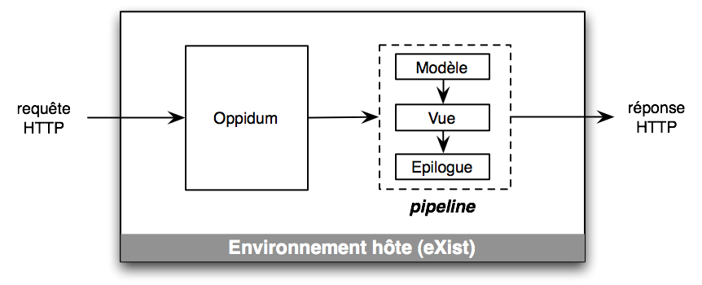
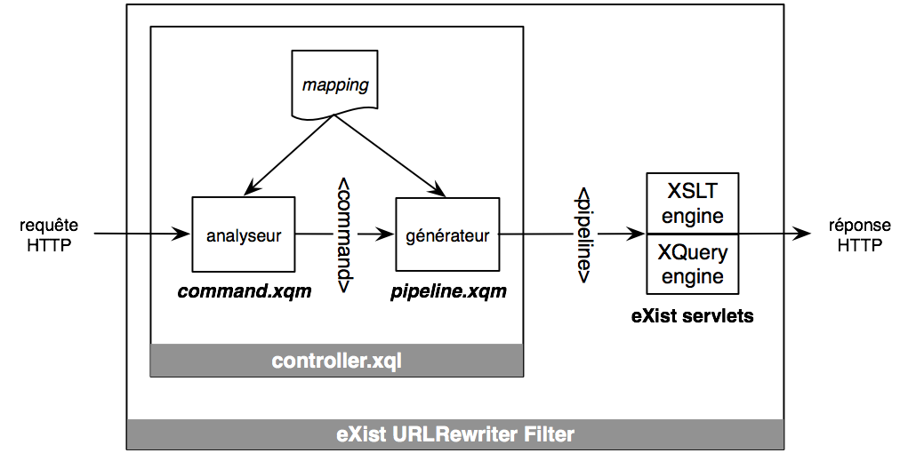
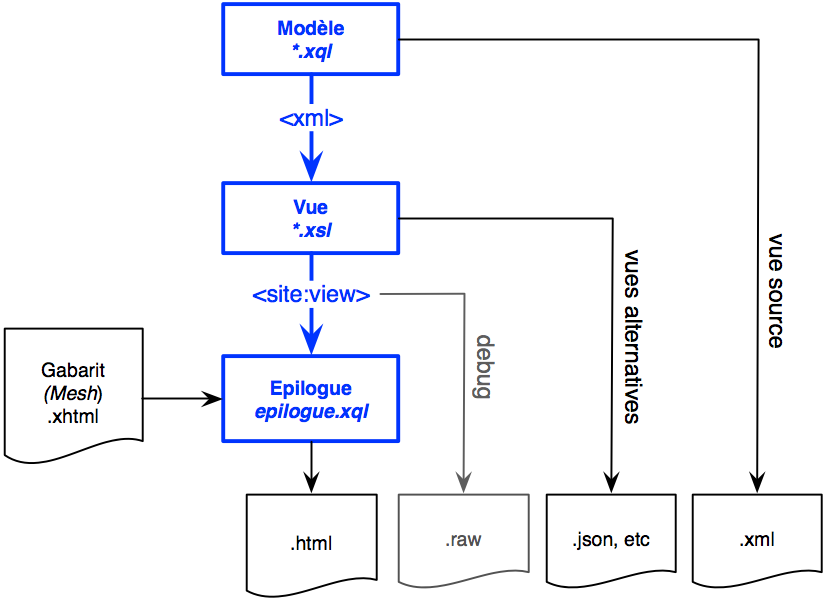

Créer des sites Web avec Oppidum
================================

Par Stéphane Sire (Oppidoc), <s.sire@free.fr>, Octobre 2011

Ce document présente le framework Oppidum pour le développeur de sites Web.

Introduction
------------

Oppidum est un framework léger conçu pour faciliter le développement de sites Web ou d'applications Web d'édition et de publication de documents. 

Le schéma suivant représente une vue synoptique du fonctionnement d'Oppidum : dans un premier temps la requête de l'utilisateur sert à générer un *pipeline*; dans un deuxième temps l'environnement hôte exécute le pipeline dont la sortie forme la réponse HTTP.

Oppidum doit donc s'exécuter dans un environnement hôte possédant un moteur d'éxécution de pipeline. Actuellement la librairie de base Oppidum est écrite en XQuery et nécessite également une base de donnée XML munie d'un interpéteur XQuery. Nous utilisons la base de données eXist qui possède aussi un moteur d'exécution de pipeline basé sur un mini-language de pipeline. 

Oppidum s'inspire des frameworks Orbeon et Ruby on Rails. Comme avec Orbeon le rendu des pages s'effectue par la transformation de données en une représentation à l'aide d'un pipeline (approche MVC). Le pipeline de rendu obéit toujours au même schéma à trois étages : le modèle est un script XQuery qui extrait des données; la vue est un script XSLT qui les transforme; le résultat peut-être inséré à la demande dans un *gabarit de site* (ou *mesh*) écrit avec un langage spécifique. Cette dernière opération est réalisée par un script appelé *epilogue*.

Comme avec RoR, l'architecture REST du site est explicite et la correspondance entre les URLs des ressources qui forment le site et leur implémentation, sous forme de pipeline, est décrite dans un langage spécifique : le *mapping* du site (plus ou moins équivalent aux routes de RoR). De manière plus annedoctique Oppidum fournit également une *flash* pour afficher des messages d'erreur ou d'information à l'utilisateur même après une redirection de page.

Oppidum contient également des modèles et vues de base pour réaliser des fonctionnalités comme un login et du contrôle d'accès, ou bien la publication et l'édition de pages à l'aide de la librairie Javascript AXEL.

Enfin il est facile d'isoler des fonctionnalités dans des modules pouvant être recopiés d'application à application avec peu d'adaptations. Il existe par exemple un module de téléchargement d'images (lié avec la librairie AXEL) et 
un module de gestion de comptes utilisateurs.

Oppidum et ses modules sont définis dans le namespace `"http://oppidoc.com/oppidum/"` et ses dérivés.

Architecture
------------

Le cycle de base d'Oppidum, détaillé sur le diagramme ci-dessous, est le suivant:

- convertir la requête HTTP en une commande
- valider la commande 
- générer un pipeline (d'erreur ou d'exécution) pour représenter la ressource et/ou le résultat de l'action concernée
- exécuter le pipeline

La commande et le pipeline sont des documents XML manipulés en interne par le framework. 

Le script `controller.xql` doit se trouver à la racine de l'application et appeler les bonnes méthodes de `command.xqm` et de `pipeline.xqm`. Ce script contient actuellement le mapping déclaré en ligne dans une variable.
  
La meilleure manière d'écrire le contrôleur est de le recopier depuis une application existante et de l'adapter pour une nouvelle application. À terme le mapping sera sorti du script et placé dans la BD.

###Modules###

Le noyau de la librairie est formé de 5 modules XQuery situés dans le répertoire `lib` de la distribution :

- le module `command.xqm` prend en entrée une requête HTTP, le fichier de mapping de l'application et génère un document XML représentant la commande de l'utilisateur (méthode `oppidum:parse-url`)

- le module `pipeline.xqm` prend en entrée une commande et génère une implémentation de pipeline pour le filtre de servlet XQueryURLRewrite d'eXist (méthode `oppidum:pipeline`)

- le module `epilogue.xqm` contient des fonctions utilitaires pour simplifier la création de l'épilogue du site (cf. ci-dessous)

- le module `util.xqm` contient des fonctions pour gérer les message d'information ou d'erreur à l'utilisateur, des fonctions pour implémenter un pseudo-langage de gestion des droits d'accès, et divers autres utilitaires.

- le module `install.xqm` contient des fonctions pour packager les données du site mais aussi le code du site dans la base de données.

###Exécution###

Le pipeline généré est exécuté par le filtre URLRewriter d'eXist en faisant appel aux servlets XQuery et XSLT. Le diagramme ci-dessous montre différents modèles d'exécution du pipeline à trois étage pour obtenir  différents types de sorties :

Le modèle d'exécution le plus courant utilise les 3 étages du pipeline pour générer une page HTML en sortie : le script XQuery génère des données XML dans un format quelconque, par contre le script XSLT doit générer une vue à l'intérieur d'un document `<site:view>` spécifique. La vue est un modèle simple et modulaire conçu pour être ensuite inséré dans un gabarit de page par l'épilogue.

L'épilogue est un script `epilogue.xql` qui doit toujours s'appeler ainsi et être placé à la racine de l'application, au même niveau que le script  `controller.xql`. La meilleure manière d'écrire ce script est de le recopier depuis une application existante et de l'adapter pour une nouvelle application.

Il est possible de court-circuiter le modèle d'exécution à 3 étages de plusieurs manières. 

En premier lieu, il est possible de spécifier une extension (.raw ou .xml) dans l'URL qui court-circuite le pipeline. L'extension .xml renvoie directement le résultat du premier étage tandis que l'extension .raw renvoie la sortie de la transformation XSLT. Cette 2e possibilité est surtout utilisée pour debugger l'application et devrait être désactivée en production.

En second lieu, le mapping peut également spécifier des pipelines incomplets, de manière à générer des représentations dans d'autres formats. Par exemple le passage par l'épilogue n'est pas nécessaire pour générer du JSON à partir du modèle ou de la vue, de même pour générer une réponse XML à une requête Ajax.

Finalement, il est également possible de spécifier dynamiquement à l'intérieur d'un modèle XQuery qu'un pipeline doit se terminer par une redirection (avec la méthode `oppidum:redirect`), dans ce cas l'exécution de l'épilogue se limite à appeler `response:redirect-to` sur la réponse.

Les langages spécifiques
------------------------

Oppidum introduit plusieurs idiomes XML pour décrire différentes facettes du site Web de manière déclarative. Le mapping est le plus important du point de vue du développeur de site pour représenter l'espace d'entrée de l'utilisateur (les URLs) et sont association avec les pipelines servant à générer les réponses. La commande et le pipeline sont utilisés en interne pour exécuter les requêtes. La connaissance du langage décrivant la commande est utile pour les développeurs des modèles XQuery car la commande est disponible aux scripts sous forme d'un attribut de la requête. Le pipeline est le moins important des trois, il peut être utile néanmoins de le connaître pour debugger.

###Le mapping###

Le mapping décrit l'architecture REST du site, c'est-à-dire qu'il définit l'ensemble des ressources, des contrôleurs et des actions qu'il est possible d'exprimer sous forme d'URLs et de méthodes HTTP. Il définit également les pipelines à mettre en oeuvre pour générer les représentation de ces resources ou effectuer les actions des contrôleurs.

####Modélisation RESTful du site sous forme de resources####

Le mapping décrit l'arborescence du site par un arbre XML composé de deux types d'éléments: *item* et *collection*. Ces deux éléments portent un attribut *@name* qui correspond à un segment de l'URL identifiant une ressource.

Le mapping suivant :

    <site>
      <item name="home"/>
      <item name="projets">
        <item name="axel"/>
        <item name="oppidum"/>
      </item>
    </site>

décrit un site composé des ressources suivantes:

    /home, /projets, /projets/axel, /projets/oppidum

L'élément collection définit des ressources contenant un nombre indéfini de ressources dont les noms sont également indéfinis. Un élément item anonyme (sans attribut name) représente les ressources contenues dans la collection.

Le mapping suivant :

    <site>
      <collection name="societes">
        <item/>
      </collection>
    </site>

décrit un annuaires de sociétés qui pourrait contenir les ressources suivantes :

    /societes/, /societes/1, /societes/2, ...

Mais tout aussi bien les ressources suivantes, puisqu'aucune contrainte ne pèse sur le nom de la ressource anonyme :

    /societes/, /societes/edsi-tec, /societes/docetis, /societes/oppidoc, ...

    
Il est également possible d'inclure des éléments item non anonymes au sein d'une collection. Dans ce cas ils décrivent la ressource de la collection de même nom qui n'est alors plus représentée par l'élément item anonyme.

Par exemple si l'annuaire concerne des sociétés installées en France ou en Suisse, il est possible de créer deux ressources pour représenter la liste des sociétés implantées respectivement dans chaque pays:

    <site>
      <collection name="societes">
        <item/>
        <item name="France"/>
        <item name="Suisse"/>
      </collection>
    </site>

La définition ci-dessus ajoute les ressources suivantes au site :

    /societes/France, /societes/Suisse
    
Si le nombre de  pays couverts par l'annuaire n'est pas connu d'avance, il est  préférable de créer une nouvelle collection de pays au sein de la collection sociétés : la ressource associée à chaque pays représentera le catalogue des sociétés de ce pays. Dans ce cas il suffit d'ajouter une collection pays dans la collection sociétés contenant un item anonyme pour représenter le pays :

    <site>
      <collection name="societes">
        <item/>
        <collection name="pays">
          <item/>
        </collection>
      </collection>
    </site>
    
Avec la définition ci-dessus il devient possible, en plus des URLs déjà indiquées, d'utiliser des URLs de la forme :

      /societes/pays/Angola, /societes/pays/Mexique, ...
      
Ces exemples montrent la souplesse de l'imbrication de seulement deux types d'éléments collection et item (anonyme ou non) pour modéliser une hiérarchie des ressources. **Tous les sites réalisés avec Oppidum doivent au préalable être modélisés suivant cette hiérarchie**.

####Définition des pipelines####

L'arbre du site constitué des éléments collection et item sert aussi à déclarer les pipelines associés à chaque ressource. L'arbre est augmenté à cette fin avec de nouveaux éléments et attributs : les éléments fils *model* et *view*, ainsi que l'attribut *@epilogue*.

Par exemple l'extrait suivant : 

    <collection name="societes" epilogue="standard"/>
      <model src="models/societes.xql"/>
      <view src="views/societes.xsl"/>
    </collection>
    
indique que pour une requête GET sur la ressource `/societes`, la représentation retournée est calculée par l'exécution du script XQuery `models/societes.xql`, puis transformation du résultat par la feuille de style `views/societes.xsl`, et enfin par insertion dans le gabarit de page `standard.xhtml` par l'épilogue du site.

Les chemins d'accès aux scripts XQuery ou XSLT sont exprimés relativement au fichier `controller.xql` à la racine de l'application. Il est toutefois possible d'utiliser le préfixe `oppidum:` devant le chemin pour désigner un  scripts fourni en standard avec Oppidum. Par exemple le chemin `oppidum:models/lore-ipsum.xql` désigne le générateur de contenu *lore ipsum* fourni par Oppidum.

Il est également possible de définir des actions asociées avec une ressource à l'aide de l'attribut *@supported* et en utilisant l'élément fils *action*. Par exemple la déclaration suivante:

    <collection name="societes" epilogue="standard" supported="ajouter"/>
      <model src="models/societes.xql"/>
      <view src="views/societes.xsl"/>
      <action name="ajouter" epilogue="standard">
        <model src="oppidum:actions/bootstrap.xql"/>
        <view src="views/ajouter.xsl"/>
      </action>
    </collection>
    
transforme la ressource sociétés en un contrôleur acceptant une action "ajouter". L'action est invoquée par l'URL suivante: `/societes/ajouter`. Celle-ci retourne une page pour éditer une nouvelle société, en utilisant la librairie AXEL par exemple.
    
Comme pour la requête GET, le pipeline de l'action est déclaré par un triplet *model*, *view* et *@epilogue*.

Oppidum converti automatiquement les verbes HTTP en actions. Ils sont déclarés dans un attribut *@method* distinct de l'attribut *@supported*. 

A titre d'exemple le traitement de la soumission d'une nouvelle société créée avec la page d'édition de société *ajotuer* est défini avec la déclaration suivante :

    <collection name="societes" epilogue="standard" 
                supported="ajouter" method="POST"/>
      <action name="POST">
        <model src="actions/post.xql"/>
      </action>
    </collection>
  
Cette fois-ci le pipeline se compose d'un unique modèle, car il retourne un message de succès ou d'erreur (XML ou JSON) à la requête Ajax de la page d'édition.

####Collection et ressource de référence####

Chaque élément collection ou item du mapping peut définir explicitement une collection et une resource *de référence* dans la BD. La collection est identifiée avec l'attribut *@db* de la racine du mapping, obligatoire, et avec la valeur de l'attribut *@collection* de l'élément ou de son ancêtre le plus proche qui en possède un (héritage). De même la resource de référence au sein de la collection de référence est identifiée avec la valeur de l'attribut *@resource* de l'élément ou de son ancêtre le plus proche. 

La collection et la ressource de référence sont un moyen simple pour communiquer au modèle la resource à extraire de la BD dans le cas d'un isomorphisme total ou partiel entre ressources du site (au sens REST) et ressources de la base de données (au sens stockage).

De plus, les attributs *collection* et *resource* peuvent contenir des variables `$NB` pour extraires les segments de rang *NB* de l'URL. 

Ainsi avec l'exemple suivant (incomplet pour simplifier) :

    <site db="/db/sites/app">
       <collection name="blog" collection="blog">
          <item collection="blog/$2" resource="entry.xml">
            <collection name="images" 
                        collection="blog/$2/images" resource="$4">
               <item/>
            </collection>
          </item>
       </collection>
    </site>
   
L'URL `/blog/10-mai-2011` est associée avec la resource `entry.xml` située dans la collection `/db/sites/app/blog/10-mai-2011`.

L'URL `/blog/10-mai-2011/images/3.jpeg` est associée avec la resource `3.jpeg` dans la collection `/db/sites/app/blog/10-mai-2011/images`.

####Déclaration du mapping####

Dans la version actuelle d'Oppidum le mapping est déclaré directement comme une variable dans le fichier `controller.xql` du site :
    
        declare variable $mapping := <site>...</site>

####Attributs hérités dans le mapping####

Les attributs suivants sont _hérités_ dans le mapping, c'est-à dire que lorsqu'ils sont déclarés sur un élement `site` (la racine), `collection` ou `item` ils sont copiés sur son élément fils, sauf si le fils redéfini l'attribut correspondant : 

- attribut `db`
- attribut `collection` (la collection de référence)
- attribut `resource` (la ressource de référence)
- attribut `access` (les droits d'accès en lecture, c-a-d pour le GET)

###La commande###

La commande contient dans un fragment XML toutes les informations extraites par Oppidum de la requête HTTP et du mapping. Elle sert d'ailleurs à générer le pipeline. 

Vous pouvez voir la commande en utilisant l'argument `?debug=true` dans n'importe quelle URL (voire la section *debugger*).

Exemple de commande:

    <command base-url="/exist/projets/platinn/" app-root="/projets/platinn/"
             exist-path="/revues/" lang="fr" db="/db/sites/platinn"
             error-mesh="standard" trail="revues" action="GET"
             type="collection">
        <resource name="revues" db="/db/sites/platinn" collection="focus"
            template="templates/form-focus" epilogue="standard"
            supported="ajouter" method="POST">
              <model src="models/revues.xql"/>
              <view src="views/revues.xsl"/>
        </resource>
    </command>
    
La commande est un élément *command* avec les attributs suivants :

- *base-url* contient la partie de l'URL menant à l'application, pour un site qui s'exécute directement sur la racine du site, elle vaut "/", cet attribut peut servir à générer des URLs absolues, entre autre dans l'épilogue

- *app-root* contient le chemin menant au fichier `controller.xql` de l'application, il est utilisé en interne par Oppidum pour indiquer le chemin des scripts à exécuter dans le pipeline

- *exist-path* est le contenu de la variable `$exist:path` transmise par eXist au contrôleur (cf. documentation eXist)

- *trail* indique la cible de la requête, c'est la partie de l'URL située après la base menant à l'application, cet attibut peut servir à générer des URLs, entre autre dans l'épilogue

- *type* est le type d'élément ciblé dans le mapping (collection ou item)

- *action* est l'action ciblée 

- *lang* est la langue courante

- *error-mesh* est le nom du gabarit à utiliser pour restituer les erreurs de validation survenant en amont de la génération du pipeline, il est recopié de la racine du mapping

- *db* est la base de données utilisée par la site, il est recopié de la racine du mapping

La commande contient toujours un élément fils *resource* qui correspond à l'élément item ou collection ciblé par la requête de l'utilisateur. Celui-ci reprend les attributs portés par cet élément dans le mapping.

La commande est accessible depuis les scripts XQuery utilisés comme modèle dans le paramètre `oppidum.command` de la requête accessible avec l'instruction suivante :

    let $ref := request:get-attribute('oppidum.command')
    
Le fait d'avoir renommée *collection* ou *item* en *resource* dans la commande permet de simplifier les expressions XPath utilisant la commande. Il est ainsi possible d'écrire `$ref/resource/@collection` au lieu de `$ref/(item|collection)/@collection` si le script attend l'un ou l'autre type de cible.
    
La plupart des scripts commencent par cette ligne pour utiliser la collection et la ressource de référence.

###Le(s) pipeline(s)###

Oppidum génère en fait le pipeline en 2 passes. Dans la première passe il génère un pipeline *abstrait* qui n'est pas dépendant d'une implémentation. Dans la seconde passe il génère le pipeline exécutable par l'environnement hôte. 

De manière succinte, le pipeline abstrait se compose des éléments suivants : 

- un élément *model* qui désigne un script XQuery dans un attribut *@src*
- un élément *view* qui désigne une transformation XSLT dans un attribut *@src*
- un élément *epilogue* qui désigne le nom du gabarit à utiliser dans l'épilogue (un identifiant) dans un attribut *@mesh* 

Ces éléments sont obtenus en combinant la commande et le mapping.

Voici un exemple de pipeline abstrait : 

    <pipeline>
      <model src="models/revues.xql"/>
      <view src="views/revues.xsl"/>
      <epilogue mesh="standard"/>
    </pipeline>

Le pipeline exécutable sera une traduction du pipeline abstrait dans le langage de pipelines du [filtre URLRewriter](http://exist.sourceforge.net/urlrewrite.html"documentation") d'eXist

Vous pouvez voir ces deux pipelines en utilisant l'argument `?debug=true` dans n'importe quelle URL (voire la section *debugger*).

###Les gabarits de pages (ou mesh)###

Chaque gabarit de page est un fichier XHTML qui contient certains éléments dans le namespace `xmlns:site="http://oppidoc.com/oppidum/site"` destinés à être remplacés par la vue ou des fragments de la vue générés par la transformation XSLT du pipeline.

Le gabarit contient aussi des éléments pour permettre à l'épilogue de placer les composants classiques d'un site tels que le bouton LOGIN ou les menus primaires et secondaires générés par l'épilogue lui-même ou bien transmis à travers des fragments de la vue.

A SUIVRE

Structure d'une application
------------------------

Les premiers projets réalisés avec Oppidum nous ont amené à privilégier l'organisation des fichiers de chaque application de la manière suivante :

    actions/
    config/
    controller.xql
    epilogue.xql
    init/
    mesh/
    models/
    modules/
    ressources/
    scripts/
    templates/
    views/

Le fichier *controller.xql* est imposé par eXist-DB. C'est le fichier qui recevra toutes les requêtes HTTP de l'utilisateur et qui appelera la librairie Oppidum pour générer le pipeline à exécuter. Dans la version actuelle il contient également la déclaration du mapping dans une variable.

Le fichier *epilogue.xql* est exécuté par le pipeline pour insérer le résultat du traitement de la requête dans un gabarit de site. 

Ces deux fichiers sont obligatoires. Comme ils sont semblables d'un projet à l'autre, le plus simple est de partir d'un projet existant pour les copier et les adapter.
    
Les répertoires *models* et  *actions* contiennent les scripts XQuery qui implémentent les modèles des ressources et des actions de l'application.

Le répertoirs *views* contient les scripts XSLT qui implémentent les vues.

Le répertoire *modules* contient également des scripts de vues et de modèles, mais en les regroupant par modules fonctionnels de manière à simplifier le partage entre applications (pour le moment par recopie du répertoire contenant le module intéressant).

Le répertoire *config* est utilisé pour le packaging. Il contient des fichiers de configuration spécifiques de eXist-DB et de l'environnement servlet (`conf.xml`, `controller-config`, `log4j.xml` et `web.xml`) pour différents environnement d'exécution (développement, pré-production et production). 

Le répertoire *init* contient éventuellement des données utilisées pour générer la base de donnée initiale ou pour tester l'application.

Le répertoire *scripts* contient le script ant pour packager l'application (e.g. `ant package` pour générer le `.war`), et un ou plusieurs scripts XQuery pour installer l'applications dans la BD (e.g. `install.xql`).

Le répertoire *resources* contient toutes les ressources statiques du site regroupées en sous-répertoires (e.g. CSS, Javascript, images). Oppidum fournit quelques méthodes pour générer des URLs pointant vers ces ressources de la forme `/static/{app-name}` (ou `/static/oppidum` pour les ressources statiques partagées par Oppidum telles que la librairie AXEL). En production ces URLs devraient être servies directement par le proxy Web sans passer par la base de données pour bénéficier d'une politique de cache efficace (actuellement non implémentée dans Oppidum).

Le répertoire *mesh* contient le ou les gabarits utilisés dans l'application (par exemple un gabarit spécifique pour les pages d'erreur). Chaque gabarit est un fichier XHTML. En se débrouillant bien chaque fichier gabarit devrait pouvoir s'afficher directement dans le navigateur Web pour tester les fichiers CSS correspondants.

Enfin le répertoire *templates* regroupe les templates XTiger XML utilisés par le site.

Cycle de développement
----------------------

###Développement###

Le développement s'effectue en créant un répertoire `projet` directement dans le répertoire `webapp` d'une installation d'eXist, sans effacer les autes fichiers de eXist. Ce répertoire projet contient le répertoire `oppidum` avec la distribution Oppidum, et le répertoire `{mon-app}` du nom de l'application en cours de développement. On obtient ainsi la structure suivante:

  {exist-home}/webapps
  {exist-home}/webapps/projet
  {exist-home}/webapps/projet/oppidum
  {exist-home}/webapps/projet/{mon-app}

L'intérêt est ainsi de pouvoir accéder dans le même serveur à toute l'aide en ligne de eXist et à la sandbox (`http://localhost:8080/exist`) et à l'application en cours de développement (`http://localhost:8080/exist/projet/{mon-app}/`).

L'intérêt est aussi de pouvoir mettre le répertoire `/projet/{mon-app}` sous contrôle du code source avec un système comme SVN ou GitGub.

Notons qu'il est également possible de développer plusieurs applications en parallèle en partageant la libriarie Oppidum en les mettant dans des répertoires frères.

###Pré-production et production###

Pour la pré-production et la production sous Tomcat, nous recommandons de placer toute l'application dans la base de donnée pour faciliter la maintenance et les évolutions. 

Dans ce cas nous avons développé un script `ant package` dans le répertoire *scripts* qui génère un fichier WAR contenant une distribution d'eXist minimale. Une fois déployée il faut alors se connecter avec le client eXist (`start.jar`) à la base de données et restaurer la ou les backups contenant la librairie Oppidum et l'application. 

Pour favriquer les copies d'Oppidum et de l'application nous utilisons un script `install.xql` lui aussi dans le répertoire *script* qui recopie tout le nécessaire dans la base de données et fixe les permission. Ce script est facile à écrire et peut se reposer sur des fonctions utilitaires du module `util.xqm` d'Oppidum.

A noter qu'en production il faut couper l'accès à l'API REST de eXist qui est par ailleurs nécessaire pour exécuter l'application depuis la base de données. Pour cela il faut modifier le fichier `web.xml` et metttre le paramètre *hidden* à `true` du servlet EXistServlet :

    <init-param>
       <param-name>hidden</param-name>
       <param-value>true</param-value>
    </init-param>

Il faut également faire attention d'utiliser une configuration de log4j non verbeuse en production, en remontant le niveau à *warn* ou *error* dans le fichier `log4j.xml`.

Nous conseillons de créer les fichiers de configuration correspondant aux différents environnement dans le répertoire *config* et à utiliser ces fichiers pour le packaging.

Outils de debug
---------------

Ajouter `?debug=true` dans une URL pour voir tous les attributs ajoutés par Oppidum à la requête et qui sont accessibles avec `request:get-attribute` dans les modèles XQUery.

Ajouter `.raw` à une requête pour voir la sortie de l'étape 2 du pipeline (transformation XSLT).

Ajouter `.xml` à une requête pour voir la sortie de l'étape 1 du pipeline (modèle XQuery).

Méthode `oppidum:log` et `oppidum:log-parameters` du module `util.xqm`...

Gestion des erreurs
----------------

Oppidum est capable de détecter certaines erreurs ou situations particulières nécessitant d'interrompre le traitement de la requête. Dans ce cas Oppidum génère un pipeline d'erreur.

Il est également possible de signaler une erreur pendant l'exécution du script XQuery générant le modèle. 

Dans les 2 cas les messages d'erreurs sont conservés dans une ressource spéciale de la base de données pour simplifier la gestion des traductions et partager certains messages.

###Erreurs avant la génération du pipeline###

####Erreur dans l'URL ou le mapping####

####Validation des resources dans la base de données####

Contrôle de l'existence de la colletion / ressource de référence (attribut *@check="true"* du mapping).

A FAIRE

####Contrôle d'accès####

Il est possible d'effectuer un contrôle d'accès en insérant des blocs `access` dans le mapping du site. Ce bloc définit des règles qui s'appliquent soit à l'item parent, soit à la collection parente suivant le contexte du bloc.

À titre d'exemple le bloc suivant indique que seul l'utilisateur dont le login est *focus* ou bien un utilisateur appartenant au groupe *site-member* est autorisé à lire une ressource (action *GET*). Seul l'utilisateur *focus* est autoriser à sauvegarder cette ressource (action *POST*) ou à effectuer l'action *ajouter* (i.e. ajouter une nouvelle page dans la collection en utilisant  AXEL pour l'éditer).

    <access>
      <rule action="GET" role="u:focus g:site-member" message="rédacteur"/>
      <rule action="POST ajouter" role="u:focus" message="administrateur du site"/>
    </access>
  
Les concepts de login ou de groupe sont le *user* et au *group* de eXist.

Le role est défini par un pseudo-langage qui comporte 4 éléments:

- `u:name` : pour désigner l'utilisateur *name*
- `g:name` : pour désigner un membre du groupe *name*
- `all` : pour désigner n'importe qui
- `owner` : pour désigner le propriétaire de la ressource / collection de référence (PAS IMPLÉMENTÉ) 

Par défaut le rôle `all` s'applique à toutes les ressources et à toutes les actions définies dans le mapping.

Ce pseudo-langage est implémenté dans le module `lib/util.xqm` d'Oppidum.

L'attribut `message` contient une indice qui peut s'insérer dans le message d'erreur (ACTION-LOGIN-FAILED) généré par le contrôle d'accès (voire à ce sujet la section sur la gestion des messages d'erreur).

Notons qu'il est également possible de définir un bloc `access` par défaut à l'aide d'une variable dans le contrôleur :

    declare variable $access := <access>...</access>
  
Cette variable est passée au moment de la validation des droits et de l'autorisation d'accès aux méthodes `oppidum:get-rights-for` et `oppidum:check-rights-for` (voire le contrôleur d'un site existant).

####Erreurs à l'exécution du pipeline####

Méthode `oppidum:render-error` du module `util.xqm`...

####Gestion des messages d'erreur####

Oppidum défini un certain nombre d'erreurs, les messages correspondants sont stockées dans la ressource `/db/oppidum/config/errors.xml`

De même chaque application peut ajouter ses propres messages ou redéfinir ceux d'Oppidume en utilisant l'emplacement standard `/db/sites/{application}/config/erros.xml`.

Créations de page éditables avec AXEL
--------------

Oppidum intègre la librairie AXEL et ses extensions AXEL-FORMS pour créer des formulaires.

Modules 
-------

Le préfixe `{module}:` dans les chemins spécifiés dans les mappings où _module_ est le nom d'un répertoire frère du répertoire `oppidum` a pour but de développer des modules partagés entre les applications basées sur Oppidum.

Évolutions futures
-------------

###Intégration de XProc###

Possibilité d'appeler un pipeline XProc comme modèle, vue ou épilogue d'un pipeline.

###Internationalisation et localisation###

Ajout d'un traitement post-epilogue pour localiser le texte.

###Epilogue en XSLT###

Pour faire comme avec Orbeon ?

###Modélisation de vues partielles###

Extension du mapping pour pouvoir réutiliser et combiner facilement plusieurs modèles / vues pour générer une seule resource. Par exemple pour faire un blog, les *latest comments* ou les *latest entries* affichés dans les colonnes latérales sont des blocs présents sur toutes les pages. Sans doute plus simple si on prévoit de remplacer le pipeline exécutable par un pipeline XProc.  

###Mettre en cache les pages pour éviter de les générer à chaque requête###

Le mapping peut conduire à créer et mettre à jour une collection `/db/caches` mirroir de l'architecture REST et contenant des caches pour chaque page. Prévoir dans ce cas une extension de l'API `oppidum:invalidate()` par exemple pour invalider la page courante, et une version plus élaborée pour invalider d'autres pages.

###Packaging XAR de la librairie et du code des applications###

Commencer à utiliser le packaging XAR à partir de eXist 2.0. Devrait encore simplifier le déploiement.

###Versions non liées à eXist###

La version actuelle d'Oppidum est fortement lièe à la base de donnée eXist-DB, mais son architecture a été conçue pour qu'il soit possible de le porter à l'avenir sur d'autres environnements (XProc, Sausalito, Mark Logic ?).

